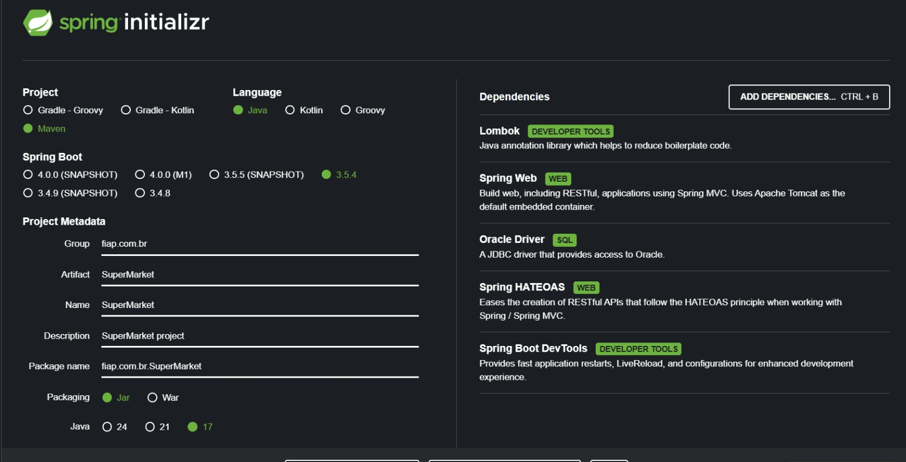

# 🛒 Projeto SuperMarket

Esta apresentação demonstra o funcionamento do sistema SuperMarket, que permite cadastrar produtos e clientes, registrar vendas de forma simples e acompanhar o histórico de transações. O sistema foi desenvolvido com Spring Boot, MySQL via Docker, utilizando Hibernate para mapeamento objeto-relacional e HATEOAS para tornar a API RESTful mais navegável. Nesta apresentação, mostramos desde o cadastro de produtos e clientes até a criação de uma venda, destacando a integração com o banco de dados e a geração automática das tabelas pelo Hibernate.

---

## 👨‍💻 Integrantes

- Caroline Assis Silva - RM 557596
- Eduardo Guilherme - RM 557886  
- Enzo de Moura Silva - RM 556532  
- Luis Henrique Gomes Cardoso - RM 558883  

---
### 🔹 Pacotes utilizados e suas funções

Entity → Mapeia tabelas e relacionamentos no banco.

Repository → Abstrai o acesso e consultas ao banco.

Service → Implementa lógica e regras de negócio.

Controller → Expõe endpoints REST e manipula requisições/respostas.

Assembler → Constrói modelos HATEOAS para respostas enriquecidas.

---

## Configuração Inicial no Spring Initializr

---
## 🔄 Exemplos de Requisições (JSON para Teste)

🌐 URL Base da API

http://34.86.191.111:8082

📌 Clientes (/clientes)
Listar todos
curl -X GET http://34.86.191.111:8082/clientes

Buscar por ID
curl -X GET http://34.86.191.111:8082/clientes/1

Criar cliente
curl -X POST http://34.86.191.111:8082/clientes \
  -H "Content-Type: application/json" \
  -d '{
    "nome": "Luis Cardoso",
    "cpf": "12345678901",
    "telefone": "11987654321",
    "endereco": "Rua Exemplo, 123 - São Paulo"
  }'

Atualizar cliente
curl -X PUT http://34.86.191.111:8082/clientes/1 \
  -H "Content-Type: application/json" \
  -d '{
    "nome": "Luis C. Atualizado",
    "cpf": "12335579901",
    "telefone": "11911112222",
    "endereco": "Rua Nova, 456 - São Paulo"
  }'

Excluir cliente
curl -X DELETE http://34.86.191.111:8082/clientes/1

---
📌 Produtos (/produtos)
Listar todos
curl -X GET http://34.86.191.111:8082/produtos

Buscar por ID
curl -X GET http://34.86.191.111:8082/produtos/1

Criar produto
curl -X POST http://34.86.191.111:8082/produtos \
  -H "Content-Type: application/json" \
  -d '{
    "nome": "Arroz 5kg",
    "codigo": "ARROZ001",
    "categoria": "Alimentos",
    "preco": 25.90,
    "dataValidade": "2025-12-31"
  }'

Atualizar produto
curl -X PUT http://34.86.191.111:8082/produtos/1 \
  -H "Content-Type: application/json" \
  -d '{
    "nome": "Arroz Integral 5kg",
    "codigo": "ARROZ001",
    "categoria": "Alimentos Saudáveis",
    "preco": 29.90,
    "dataValidade": "2026-01-31"
  }'

Excluir produto
curl -X DELETE http://34.86.191.111:8082/produtos/1

📌 Vendas (/vendas)
Listar todas
curl -X GET http://34.86.191.111:8082/vendas

Buscar por ID
curl -X GET http://34.86.191.111:8082/vendas/1

---
Criar venda

⚠️ Precisa de um cliente já cadastrado (clienteId existente).

curl -X POST http://34.86.191.111:8082/vendas \
  -H "Content-Type: application/json" \
  -d '{
    "clienteId": 1,
    "valorTotal": 100.50,
    "desconto": 10.00
  }'

Excluir venda
curl -X DELETE http://34.86.191.111:8082/vendas/1
